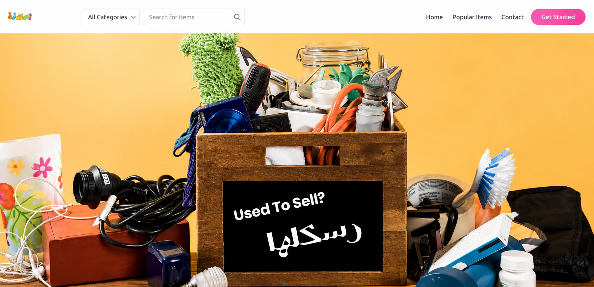
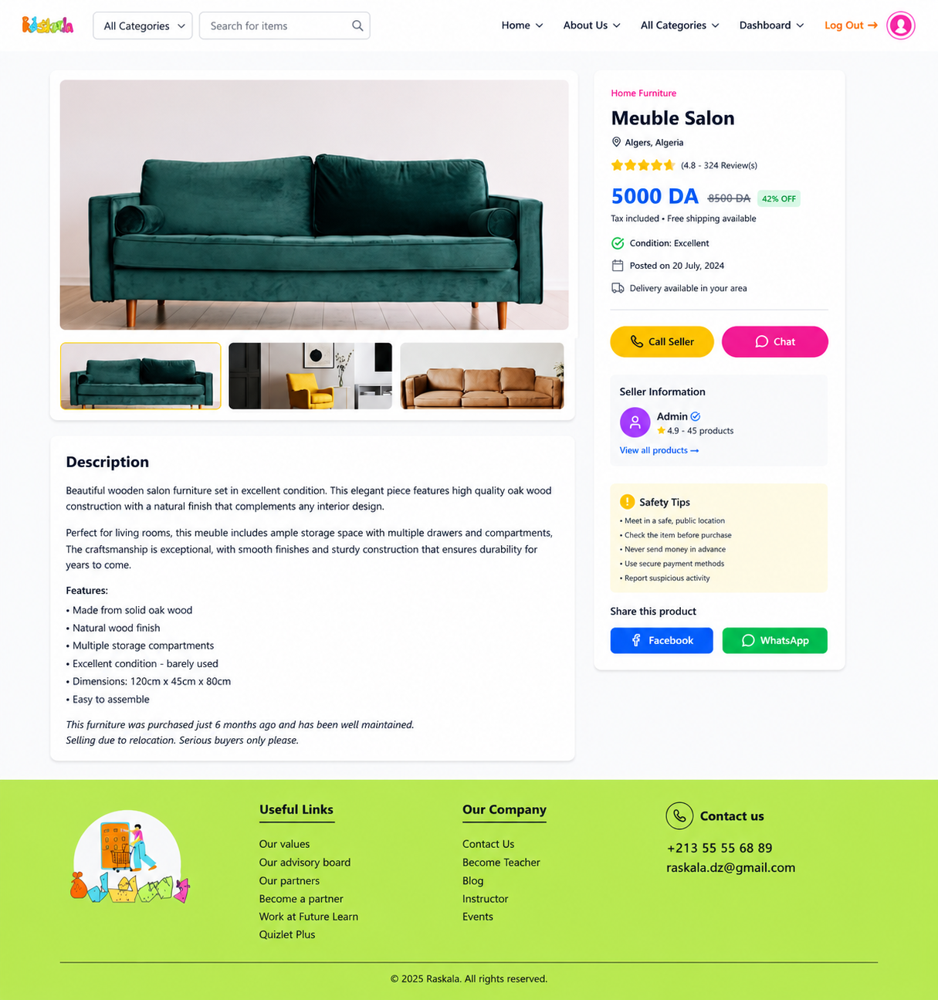

# Raskala

<p align="center">
  
  
</p>

<h3 align="center">
A Company-Supervised Marketplace for Buying, Selling, Refurbishing and Reselling Used Items
</h3>

<p align="center">


</p>

---

# 📖 About

Raskala is a **company-managed marketplace** that offers a safer and more reliable way to buy and sell used products.

Unlike traditional marketplaces where products are published immediately, every submitted item is first reviewed by the company. The company can approve or reject listings, purchase products directly from sellers, refurbish them if necessary, and resell them through the marketplace.

This workflow improves trust between buyers and sellers while encouraging sustainability through the reuse and refurbishment of second-hand products.

---

# ✨ Features

### 👤 Guest

- Browse available products
- Search products
- Filter products by category
- Register
- Login

### 👥 Registered User

- Manage profile
- Submit products for sale
- Upload multiple product images
- Track product approval status
- Browse marketplace
- Purchase products
- View order history
- Add products to favorites
- Follow other users
- Send and receive messages

### 🏢 Company (Admin)

- Review submitted products
- Approve or reject products
- Purchase products from sellers
- Refurbish purchased products
- Republish refurbished products
- Manage users
- Manage orders
- View marketplace statistics
- Reply to user messages

---

# 🔄 Marketplace Workflow

```text
Seller
   │
   ▼
Submit Product
   │
   ▼
Pending Review
   │
   ▼
Company Review
   │
 ┌──────────────┬───────────────┬───────────────┐
 ▼              ▼               ▼
Approved     Rejected     Purchased by Company
 │                               │
 ▼                               ▼
Published                 Refurbished
 │                               │
 └──────────────► Sold to Buyer ◄┘
```

---

# 🏗️ System Architecture

```text
React + Tailwind CSS
         │
         ▼
Laravel REST API
         │
         ▼
PostgreSQL Database
      (Supabase)
```

---

# 🛠️ Technologies

| Category | Technology |
|----------|------------|
| Frontend | React |
| Styling | Tailwind CSS |
| Build Tool | Vite |
| Backend | Laravel |
| Authentication | Laravel Sanctum |
| Database | PostgreSQL |
| Cloud Database | Supabase |
| HTTP Client | Axios |
| Icons | React Icons |

---

# 📸 More Screenshots

| Home | Product Details |
|------|-----------------|
|  |  |

| Seller Dashboard | Admin Dashboard |
|------------------|-----------------|
|  |  |

| Product Submission | Product Moderation |
|--------------------|--------------------|
|  |  |

| Messages | User Profile |
|-----------|--------------|
|  |  |

---

# 📂 Project Structure

```text
Raskala-Software/
│
├── frontend/
│   ├── public/
│   ├── src/
│   │   ├── assets/
│   │   ├── components/
│   │   ├── pages/
│   │   ├── services/
│   │   ├── App.jsx
│   │   ├── main.jsx
│   │   └── index.css
│   ├── package.json
│   └── vite.config.js
│
├── backend/
│   ├── app/
│   ├── routes/
│   ├── database/
│   ├── storage/
│   ├── public/
│   └── artisan
│
├── docs/
│   └── screenshots/
│
└── README.md
```

---

# 🚀 Getting Started

## Prerequisites

Before running the project, make sure the following tools are installed:

- Node.js
- npm
- Git
- PHP 8+
- Composer

Verify your installation:

```bash
node -v
npm -v
git --version
php -v
composer -V
```

---

## Clone the Repository

```bash
git clone https://github.com/HadeelLafrid/Raskala-Software.git
cd Raskala-Software
```

---

## Frontend Setup

Navigate to the frontend directory and install the required dependencies.

```bash
cd frontend
npm install
npm install react-icons
npm run dev
```

The frontend will be available at:

```
http://localhost:5173
```

---

## Backend Setup

Navigate to the backend directory.

```bash
cd backend

composer install

cp .env.example .env

php artisan key:generate

php artisan migrate

php artisan serve
```

The backend will be available at:

```
http://localhost:8000
```

---

# 🔐 User Roles

| Role | Permissions |
|------|-------------|
| Guest | Browse and search products |
| Registered User | Buy products, submit items, manage profile, messaging |
| Company (Admin) | Review products, manage users, orders, dashboard and marketplace |

---

# 🌱 Sustainability

Raskala supports the circular economy by extending the lifecycle of used products. The company can purchase second-hand items, refurbish them when necessary, and offer them again through the marketplace, helping reduce waste while providing customers with reliable and affordable products.

---

# 📄 License

This project was developed as part of a Software Engineering academic project.
````
